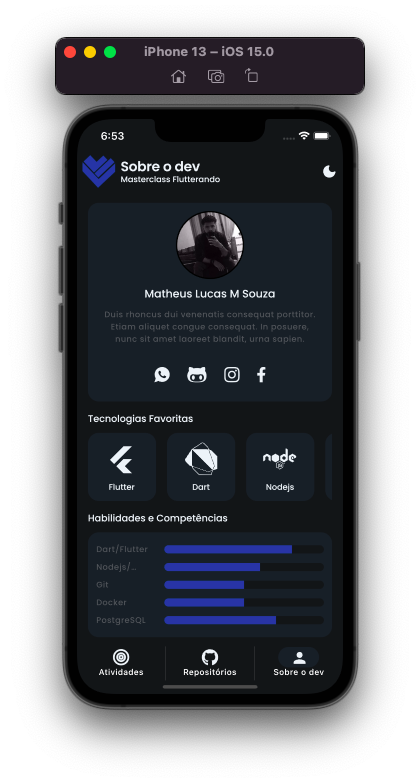
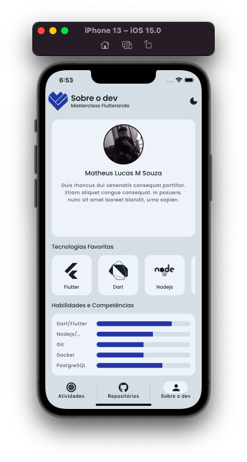
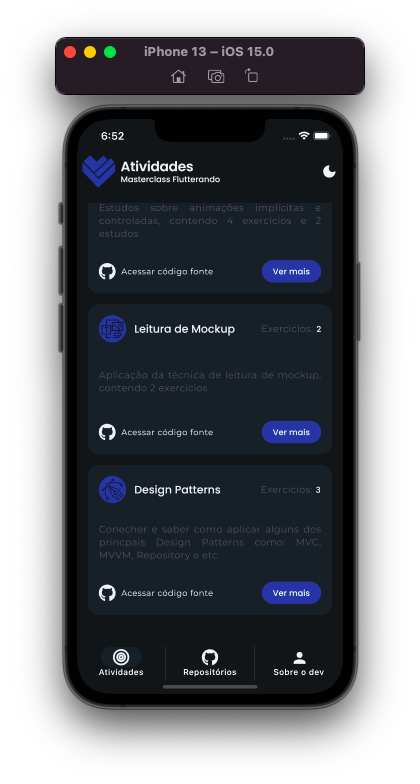
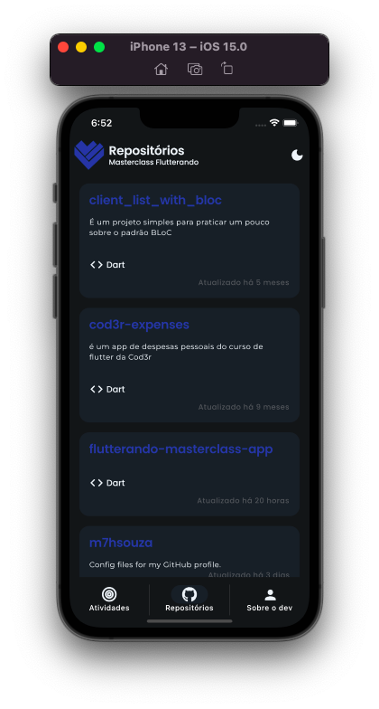

# Flutterando Masterclass App

Projeto final da masterclass da flutterando. O aplicativo tem como objetivo colocar em pratica tudo que foi abordado durante o curso como: design patterns, POO, principais conceitos do flutter e da linguagem dart, etc.
****

## Alguns dos temas abordados durante o curso

- [x] Coneitos da linguagem Dart;
- [x] Pilares da POO;
- [x] Arquitetura do Flutter;
- [x] Diferença entre `Widgets` e `Elements`;
- [x] Responsividade;
- [x] Animações `Implicitas` e `Controladas`;
- [x] Entendo o que é a `Regra de Negocio`;
- [x] Alguns Design Patterns como: `Controller`, `Presenter`, `Service`, `Repository`, `Prototype`, `Factory`, `Observer`, etc;
- [x] Principios do `SOLID`
- [x] Teste de unidade;
- [x] Gerenciamento de Estado;
- [x] Bloc;
- [x] Introdução a Arquitetura Limpa.

### Sobre o aplicativo

É um aplicativo que vai servir com um portifolio ele tem o historico de todos os `exercicios` do curso, alem de integram com api do github listado todos os repositorios do usuário e trazendo infomações sobre o dev, infomaçöes como qual é as tecnologias preferidas e as principais skills e suas "notas".

### Pacotes utilizados

- `google_fonts`
- `uno`
- `timeago`

### Temas

****

suporte a tema `light` e `dark`. Para realizar a troca do tema basta clicar no icone que fica do lado direto da `AppBar`

  
  

### Home

****

>- Pagina principal lista todos os `Modulos` do curso com: `titulo`, `descrição`, `quantidade de exercicios`;
>- Para acessar o código um modulo especifico basta clicar em `Acessar código fonte`;
>- Para ver os exercicios de um modulo clique em `Ver mais`;

### Lista de Exercicios

****

>- Lista todos os exercicios de um modulo;

### Lista de Repositorios

****

>- Lista todos os repositorios do usuário;
>- Ao clicar no repositorio sera redirecionado para pa pagina do repositorio no github;

### Sobrew o dev

****

>- Informações do dev como: `foto`, `tecnologias favoritas`, `principais skills`;</h2>
